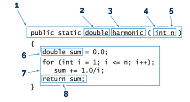

# EXAM: Programming Basics

### Getting Started
 - Fork this repository under your own account
 - Clone the forked repository to your computer
 - Create a `.gitignore` file so generated files won't be committed
 - Commit your progress frequently and with descriptive commit messages
 - All your answers and solutions should go in this repository

### What can I use?
- You can use any resource online, but **please work individually**
- **Don't just copy-paste** your answers and solutions, use your own words instead.
- **Don't push your work** to GitHub until your mentor announces that the time is up

# Tasks
## 1-3. Complete the following tasks: (~90 mins)
- [Odd Average](oddavg/OddAvg.java)
- [Copy](copy/Copy.java)
- [BlackJack](blackjack/BlackJack.java)

### Acceptance criteria
The application is accepted if:
- The solution works according to specification [1p each]
- The solution follows [styleguide](https://github.com/greenfox-academy/teaching-materials/blob/master/styleguide/java.md) [1p]
- Has proper error handling where the specification says it [1p each]
- Has the correct loops, methods, filters [1p each]
- The code is clean, without unnecessary repetition, and with descriptive names [1p each]
- You commit frequently with descriptive commit messages [1p]

## 4. Question time! (~10 mins) [4p]

### Name each building block of a method! [2p]

#### Your answer:
[add your answer here]   
1: method declaration  
2:  return type - every method has it, even void ones, but we just don't make that visible 
3:  method name
4:  input paramater, variable type
5:  input parameter, variable's name
6:  instantiate variable and assigning value to it 
7:  method body(if it is an abstract method, at the abstract class the body sould be empty, only at the sublasses should a method have and must be declared
8:   return value

### What is the constructor? When it is used? [2p]
#### Your answer:
[Constructors used in OOP.
Constructor is a special method, that exsist to construct the object. It will be called, when the object is created. It usually consists of instance variables, a constructor method, and sometimes even with overloaded constructors.
Constructors can be called from other classes based on the access(public, private, package-private) it should be done slightly diferrently.
Here is a constructor:
public class SpaceShip{
// an empty contructor:
public[access] Spaceship[class name] () {
}
//overloaded contructor:
public[access] SpaceShip [it has to be identical to the class name] (String n [parameter]) {
  [initialization code comes here]
 
 }
}]
